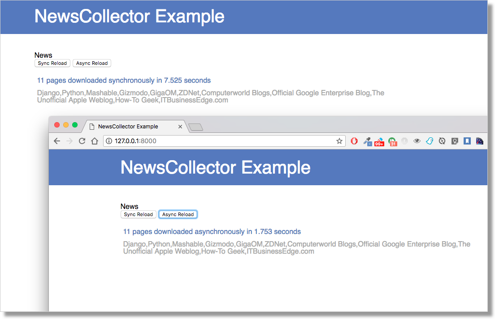

NewsCollector
=============

This examples shows off how asynchronous programming helps speed things
up even inside of a simple HTTP request.

This codebase fetches RSS feeds from a collection of other websites using
a HTTP client - something that can only be done one at a time with synchronous
code. The asynchronous version fetches them all in parallel, and the example
lets you compare and contrast the runtimes of each approach.

Installation
------------

Manual installation
~~~~~~~~~~~~~~~~~~~

Make a new virtualenv for the project, and run::

    pip install -r requirements.txt

Then, you'll need Redis running locally; the settings are configured to
point to ``localhost``, port ``6379``, but you can change this in the
``CHANNEL_LAYERS`` setting in ``settings.py``.

Finally, run::

    python manage.py migrate
    python manage.py runserver

Usage
-----

No models are required, and you won't need a superuser account; just load the
page (probably at http://localhost:8000).

The home page provides two buttons to let the user download content from a
list of web pages; after data collection, the server sends back the results
packed in a JSON dictionary.

In **sync mode, downloads happen sequentially**, and the total time required to
complete the operation is at least the sum of the time required by each
individual download.

When demanding network operations are involved, there's a good chance you can
improve overall performance significantly with an async approach.

In **async mode, pages are downloaded concurrently**, and the time required to
collect all results is significantly reduced.

Sample execution
----------------

Sync session::

    Downloaded "Django" from "http://djangoproject.com/" in 1.472037 [s]
    Downloaded "Python" from "https://www.python.org/" in 0.139406 [s]
    Downloaded "Mashable" from "http://mashable.com/" in 0.271376 [s]
    Downloaded "Gizmodo" from "http://gizmodo.com/" in 0.262348 [s]
    Downloaded "GigaOM" from "http://gigaom.com/" in 0.235854 [s]
    Downloaded "ZDNet" from "http://www.zdnet.com/" in 0.444768 [s]
    Downloaded "Computerworld Blogs" from "http://blogs.computerworld.com/" in 0.189739 [s]
    Downloaded "Official Google Enterprise Blog" from "http://googleenterprise.blogspot.com/" in 1.3525 [s]
    Downloaded "The Unofficial Apple Weblog" from "http://www.tuaw.com/" in 0.811099 [s]
    Downloaded "How-To Geek" from "http://www.howtogeek.com/" in 0.181826 [s]
    Downloaded "ITBusinessEdge.com" from "http://www.itbusinessedge.com/" in 1.278017 [s]
    All downloads completed; elapsed time: 6.639587 [s]
    Slowest download required: 1.472037 [s]

Async session::

    Start downloading "Django"
    Start downloading "Python"
    Start downloading "Mashable"
    Start downloading "Gizmodo"
    Start downloading "GigaOM"
    Start downloading "ZDNet"
    Start downloading "Computerworld Blogs"
    Start downloading "Official Google Enterprise Blog"
    Start downloading "The Unofficial Apple Weblog"
    Start downloading "How-To Geek"
    Start downloading "ITBusinessEdge.com"
    All downloads completed; elapsed time: 1.387465 [s]

Further Reading
---------------

- `Python & Async Simplified <https://www.aeracode.org/2018/02/19/python-async-simplified/>`_
- `Making 1 million requests with python-aiohttp <https://pawelmhm.github.io/asyncio/python/aiohttp/2016/04/22/asyncio-aiohttp.html>`_
